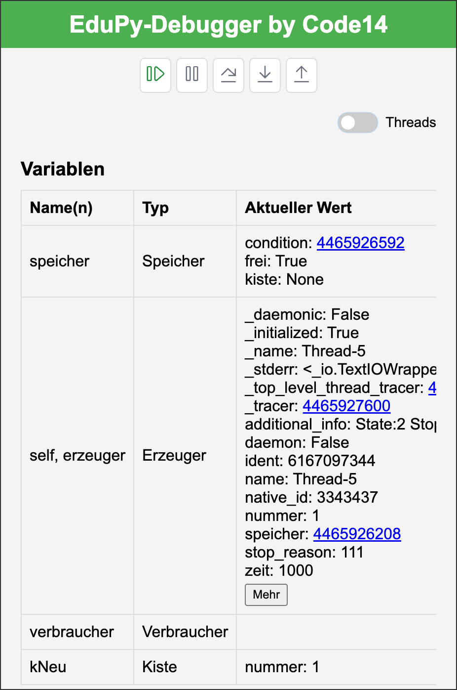
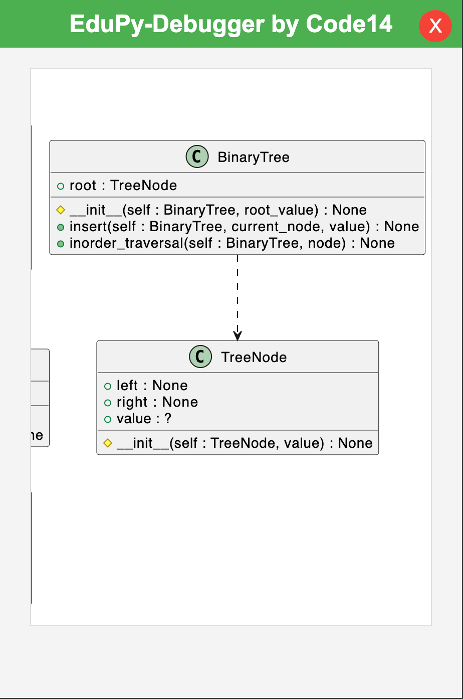
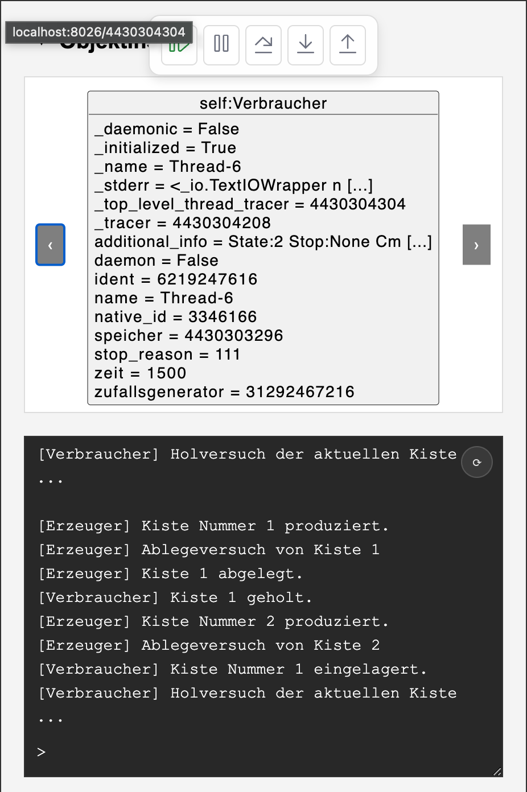

# EduPy-Debugger

<!-- Plugin description -->
EduPy-Debugger is a lightweight, web-based debugging companion for Python in PyCharm. It offers visual object inspection, UML-style diagrams, and an integrated console in a clean tool window.

EduPy‑Debugger ist ein schlankes, webbasiertes Debug‑Werkzeug für Python in PyCharm (Community & Professional) – mit klarem Fokus auf Unterricht und Einstieg. Es kombiniert eine aufgeräumte Debug‑Ansicht mit visualisierten Objekten und einer integrierten Konsole.

Kurzüberblick:
- Objekt‑Inspektion als PlantUML‑Karten mit klickbaren Referenzen (refid → Karte).
- Variablen‑Tabelle mit kompakten Vorschauen und „Mehr/Weniger“‑Ansicht für komplexe Werte.
- Interaktive Konsole: REPL‑Nutzung ohne Debug‑Sitzung, print‑Ausgaben, input‑Abfragen, Fehler‑Hinweise.
- Diagramme: Klassendiagramm (Struktur) und Objektdiagramm (Laufzeitinstanzen).
- Thread‑Anzeige (experimentell). Stepping ist in Python global; Single‑Thread‑Stepping kann nicht garantiert werden.
<!-- Plugin description end -->

<!--

[](https://plugins.jetbrains.com/plugin/PLUGIN_ID)
[](https://plugins.jetbrains.com/plugin/PLUGIN_ID)
-->

## Inhaltsverzeichnis
1. Hauptfunktionen
2. Warum EduPy-Debugger?
3. Screenshots
4. Voraussetzungen
5. Installation
6. Schnellstart
7. Verwendung im Detail
8. Fehlerbehebung & FAQ
9. Mitwirken
10. Fahrplan
11. Lizenz

---

## Hauptfunktionen

| Kategorie                            | Dein Nutzen |
|--------------------------------------|-------------|
| Visuelle Objekt-Inspektion           | Live-Objektkarten & Beziehungen als PlantUML-Diagramme – Schluss mit mühsamem Suchen in „Watches“. |
| Klassen- & Objekt-Diagramme          | Ein Klick öffnet eine UML-ähnliche Übersicht aller Klassen und Laufzeit-Objekte. |
| Interaktive Konsole-I/O              | Eingaben via `input()` werden direkt an den Prozess weitergeleitet, Ausgaben in Echtzeit zurückgestreamt. |
| Navigation mit einem Klick           | Springe von einer Variablen zu ihrer Objektkarte oder folge Referenzen per Mausklick. |
| Browser-basierte UI                  | Dank JBCef plattformübergreifend identisch und auf einen zweiten Monitor abdockbar. |
| Vertraute Debug-Steuerung            | Fortsetzen, Anhalten, Step-Over/Into/Out – über Standard-Shortcuts & Toolbar-Buttons. |
| Thread-Unterstützung (experimentell) | Schalte einfach zwischen Threads, um Call-Stacks & Variablen jeder angehaltenen Ausführung zu untersuchen. |

---

## Warum EduPy-Debugger?

Der Standard-Debugger von PyCharm ist mächtig, seine Oberfläche wirkt für Einsteiger jedoch schnell überfordernd – besonders im Unterricht.  
EduPy-Debugger ergänzt daher links ein eigenes Tool-Fenster, das auf Klarheit setzt: Variablen sind gruppiert, Objekte visualisiert und die Konsole stets griffbereit. Im Hintergrund läuft ein schlanker HTTP- und WebSocket-Server, der automatisch mit dem Klick auf ▶ Debug startet.

Die Anwendung folgt u.a. drei, von JetBrains empfohlenen UX-Prinzipien:

- **Vorhersehbarkeit** – alle Aktionen entsprechen bekannten Debug-Funktionen, nichts ist „magisch“ versteckt.
- **Minimalismus** – es wird nur gezeigt, was im Moment relevant ist; erweiterte Bereiche bleiben eingeklappt, bis man sie braucht.
- **Progressive Offenlegung** – komplexere Details (Threads, tiefe Objekt-Graphen) sind optional, damit Neulinge nicht abgeschreckt werden.

---

## Screenshots

<div align="center">
  
  
  
  
</div>

---

## Voraussetzungen

- PyCharm 2022.3.3 oder neuer (Community **oder** Professional)
- JBCef-Unterstützung (in der IDE gebündelt)
- Ein in PyCharm eingerichteter Python-Interpreter
- Betriebssystem: Windows, macOS oder Linux (jede Architektur, die PyCharm unterstützt)

---

## Installation

### JetBrains‑Marketplace (empfohlen)

1. **Einstellungen / Preferences → Plugins** öffnen.
2. Nach „**EduPy-Debugger**“ suchen.
3. **Installieren** und IDE neu starten.

### Manuelle Installation

```bash
# 1. Klonen
git clone https://github.com/Julian-Code14/EduPy-Debugger.git
cd EduPy-Debugger

# 2. Plugin-ZIP bauen
./gradlew buildPlugin

# 3. Installieren
# Settings → Plugins → ⚙ → „Plugin from disk …“ wählen und ZIP-Datei auswählen
```

---

## Schnellstart

| Schritt | Aktion                                                                            |
|---------|-----------------------------------------------------------------------------------|
| 1 | Öffne oder erstelle ein Python‑Projekt.                                           |
| 2 | Optional: Nutze direkt die <b>Konsole</b> als REPL (ohne Debug‑Sitzung) für schnelle Experimente. |
| 3 | Setze Breakpoints und klicke **Debug**.                                           |
| 4 | Steuere die Ausführung mit den grünen ▶, blauen ⏸ und gelben ↷ Buttons.           |
| 5 | Klicke unten auf **Klassendiagramm** oder **Objektdiagramm** für eine Übersicht.  |
| 6 | Aktiviere den **Threads‑Schalter**, falls du andere Threads untersuchen möchtest. |

---

## Verwendung im Detail

### Aufbau des Tool‑Fensters

- **Kontrollleiste** – fixierte Toolbar mit Resume/Pause/Step‑Aktionen.
- **Threads‑Panel** – standardmäßig verborgen; zeigt Dropdown aller Python‑Threads samt Call‑Stack (experimentell).
- **Variablen‑Tabelle** – Name, Typ, Wert, Scope und interne `id()`; Vorschau/„Mehr“ für komplexe Werte; Klick auf Namen/IDs öffnet die passende Objektkarte.
- **Objekt‑Inspektor** – Karussell aus PlantUML‑Karten; mit ◂ ▸ navigieren. Klicks auf refid springen zur Karte und scrollen automatisch zum Inspektor.
- **Konsole** – REPL‑Eingaben ohne Debug‑Sitzung, `print`‑Ausgaben, `input`‑Abfragen und Fehler‑Hinweise; mit ↵ senden.
- **Unterer Bereich** – Buttons zu vollformatigen Klassen‑ bzw. Objekt‑Diagrammen.

---

## Konfiguration

Derzeit keine eigene Einstellungsseite – einfach installieren und loslegen.  
Fortgeschrittene können die Ports (`8025` / `8026`) in `DebugWebSocketServer` & `DebugWebServer` vor dem Build anpassen.

---

## Fehlerbehebung & FAQ

<details>
<summary><strong>WebSocket-Verbindung fehlgeschlagen</strong></summary>

- Firewall prüfen: Ports **8025** und **8026** müssen frei sein.
- Sicherstellen, dass das EduPy-Debugger-Fenster offen ist; die Server starten erst bei Debug-Beginn.
</details>

<details>
<summary><strong>Fenster leer / Browser lädt nicht</strong></summary>

- In ressourcenarmen Umgebungen könnte JBCef deaktiviert sein – prüfen unter *Registry → ide.browser.jcef.enabled*.
</details>

<details>
<summary><strong>Diagramme leer oder fehlerhaft</strong></summary>

- Kurz warten und erneut öffnen. Falls weiterhin leer: IDE‑Log prüfen und ein Issue eröffnen (gern mit minimalem Beispiel). PlantUML ist als Abhängigkeit gebündelt; keine manuelle Installation erforderlich.
</details>

Für weitere Hilfe: Issue eröffnen oder @Julian-Code14 anpingen. Eine kompakte Anleitung findest du im Footer unter **Hilfe**.

---

## Mitwirken

Pull‑Requests, Feature‑Ideen und Bug‑Reports sind herzlich willkommen!  
Bei größeren Vorhaben bitte vorab ein Issue eröffnen, um Doppelarbeit zu vermeiden.

### Build & Tests

```bash
./gradlew clean build test
```

Das Plugin in einer isolierten PyCharm‑Instanz starten:

```bash
./gradlew runIde
```

Unit‑Tests befinden sich in `src/test/java` (Mockito).  
Integrationstests nutzen das IntelliJ‑Platform‑Testing‑Framework.

---

## Rechtliches & Kontakt

- Hilfe: siehe Footer‑Link „Hilfe – So verwendest Du den EduPy‑Debugger“.
- Datenschutz: „Datenschutzerklärung“ (keine Übermittlung personenbezogener Daten durch das Plugin).
- Nutzungsbedingungen: siehe Seite „Nutzungsbedingungen“ (u. a. Haftungs‑/Gewährleistungsausschluss).
- Kontakt: julian.flach@code14.de.

## Lizenz

EduPy‑Debugger steht unter der **MIT‑Lizenz**.  
Den vollständigen Text findest du in der Datei **LICENSE.txt**.
